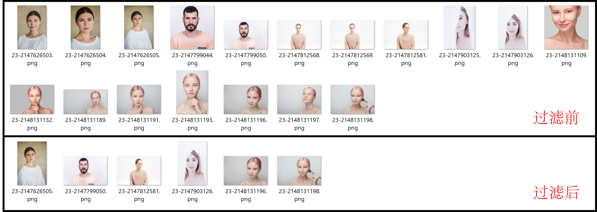

## 准备工作

```bash
pip install Scrapy
```

## 运行实例

```bash
scrapy crawl pexels
scrapy crawl unsplash
scrapy crawl huaban
```

Pexels 和 Unsplash 需要首先注册一个开发者账户申请 API KEY 后填入，修改参数只需要修改 `api_crawler/config/base_config.py` 即可。具体参数请参考代码文件下的详细注释。最后得到的是一个包含图片链接和图片 ID 的 txt 文件，之后可以使用另外一个库的 `download_image.py` 下载即可。

--- 2024.9.11 更新 ---

添加 Freepik、iStock、gettyimages、Adobe Stock 和 shutterstock 五个网站的爬虫接口，目前全部只能爬取预览图片，需要额外安装 Selenium 库并下载对应自己电脑的 [ChromeDriver](https://developer.chrome.com/docs/chromedriver/downloads) 到文件夹 `driver/` 中。Freepik 由于采取了 lazy load 的机制，所以需要使用 Selenium 并等待加载过程，故爬取速度较慢（20s/page）。

```bash
pip install selenium
```

同样需要修改配置文件，运行命令与前文相同：

```bash
scrapy crawl freepik
scrapy crawl istock
scrapy crawl gettyimages
scrapy crawl adobestock
scrapy crawl shutterstock
```

--- 2024.9.14 更新 ---

添加复制检测以及图片下载的代码，后者重写了 MediaCrawler 中的图片下载实现，更加简洁易读。复制检测代码默认使用 ISC21 特征描述符，指定参数、自定义使用其他特征描述符以及添加额外的过滤器请参考代码注释，或者使用 `python download_img.py --help` 查看详细信息。【注】海外网站下载图片时需要开启代理，并且尽量保证 Route 使用 IPV4 Only 策略，防止使用 IPV6 连接出现未知网络错误。 

目前主要提供了三个函数：

1. deduplicate 提取所有图片的特征并根据相似度进行过滤，最后得到一个 json 文件，内容示例如下所示，表示图片与对应的复制数组，数组中给出图片的 ID 以及二者之间的相似度。向量数据库会储存在一个 .bin 文件中方便重复使用，并且维护一份 ID <-> Index 的映射 json 文件。【注】图片 ID 即图片的文件名。

    ```
    {
        "1001961132.png": [
            {
                "1001961742.png": 0.4993073046207428
            }
        ],
        "1001961768.png": [
            {
                "1001961742.png": 0.42799073457717896
            }
        ],
        "1002042418.png": [
            {
                "1002042420.png": 0.5907149314880371
            }
        ],
        ...
    }
    ```

2. similarity 用于测试，指定两张图片的 ID 得到二者之间的相似度。

3. unique 根据 deduplicate 得到的 json 文件进行去重，将结果图片保存到一个新文件夹。

### 复制检测示例



--- 2024.09.18 更新 ---

添加组合生成代码，生成多样妆容方案，并且保证腮红、眼妆、口红三个主要部位最多只有一个部位的妆造类型重复。具体运行方法请参考代码注释，或者使用 `python combine.py --help` 查看详细信息。 【注】因并无使用生成器实现，当组合数过多时会耗费大量内存。